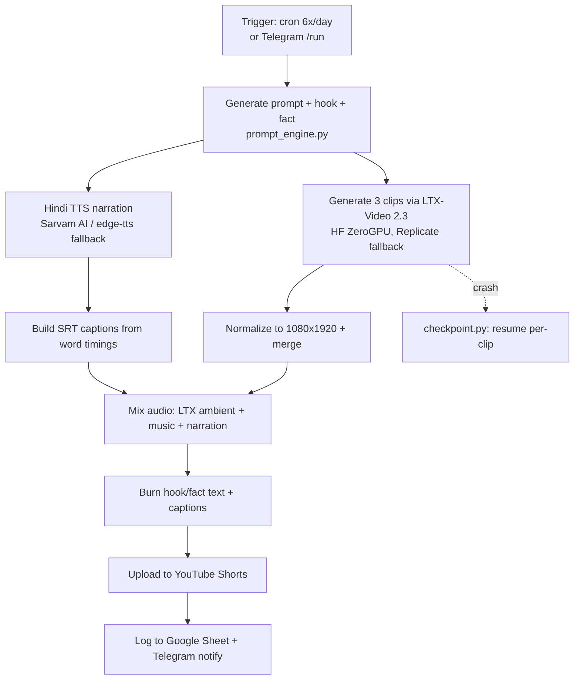

# ltxflows

AI-generated Hindi "satisfying" Shorts pipeline. Uses LTX-Video 2.3 (free ZeroGPU inference) to generate short AI video clips, narrates them with Hinglish TTS, burns synced captions, and auto-posts to YouTube Shorts 6x/day.

## How it works

1. **Prompt** — `prompt_engine.py` picks a random niche and generates an image prompt, an LTX-Video prompt, a "fact" + viral hook line, and the Hinglish narration text.
2. **Narrate** — `generate_tts` synthesizes Hindi narration via Sarvam AI TTS (falls back to `edge-tts` if the Sarvam key/quota is unavailable), producing word-level timings used to build an `.srt` caption file.
3. **Generate clips** — `video_generator.generate_clip` renders 3 clips of 10s each via LTX-Video 2.3 on Hugging Face's free ZeroGPU; if quota is exhausted it transparently falls back to a paid Replicate run (and notifies via Telegram).
4. **Assemble** — clips are normalized to 1080×1920, concatenated, and the audio is mixed from up to three layers: LTX's native ambient audio, low-volume background music (picked from `music_library.json`), and the Hindi narration — then the hook/fact text and synced captions are burned in.
5. **Publish** — the finished Short is uploaded to YouTube with a Hindi title/description, the run is logged to a Google Sheet, and a Telegram summary is sent.
6. **Resume** — every step (`videos_selected → clip_N_done → merged → encoded → uploaded`) is checkpointed in `checkpoint.py`/`tracker.json` so a crash resumes instead of restarting; daily posting is capped at 6/day unless force-run.



## Architecture

| File | Role |
|---|---|
| `pipeline_ci.py` | Main orchestrator — TTS, clip generation, encoding, upload |
| `prompt_engine.py` | Niche/prompt/title/fact/hook generation |
| `video_generator.py` | LTX-Video 2.3 clip generation (HF ZeroGPU + Replicate fallback) |
| `checkpoint.py` | Resume state machine |
| `cleanup.py` | Temp/output cleanup |
| `drive_manager.py` | Google Drive helpers for shared state/tokens |
| `music_library.json` | Background track catalog |

## Setup

```bash
pip install -r requirements_ci.txt
python pipeline_ci.py
```

Key env vars: `SARVAM_API_KEY`, `SHEET_ID`, `TELEGRAM_BOT_TOKEN`, `TELEGRAM_CHAT_ID`, `FORCE_RUN`.
